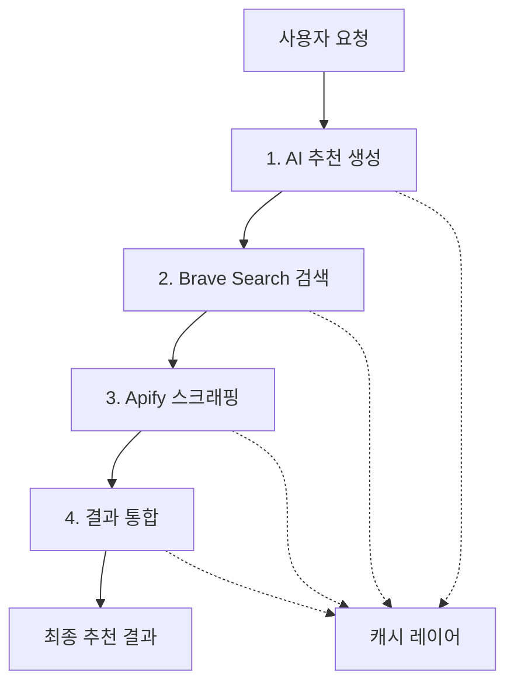

# Gift Genie MCP 파이프라인 설계서

> **Sequential MCP 서버를 활용한 체계적 AI 추천 시스템**  
> 작성일: 2025-07-25  
> 버전: 1.0

## 🎯 파이프라인 개요

Gift Genie의 MCP(Model Context Protocol) 파이프라인은 **Sequential MCP 서버**를 핵심으로 하여 4단계의 체계적인 AI 추천 프로세스를 구현합니다.

### 📊 핵심 성능 지표
- **목표 응답시간**: < 10초 (P95)
- **최소 추천 보장**: 3개 이상
- **데이터 완성도**: 80% 이상
- **가용성**: 99% 이상

## 🔄 파이프라인 아키텍처



## 🚀 단계별 상세 설계

### 1단계: AI 추천 생성 (GPT-4o-mini)

**🎯 목적**: 사용자 요청을 분석하여 검색 전략 수립

**⏱️ 처리시간**: 2-3초  
**📊 데이터 크기**: ~1KB  
**🔑 중요도**: Critical Path

#### 입력 데이터
```typescript
interface GiftRequest {
  recipient: {
    gender: "male" | "female" | "neutral"
    age_group: "teens" | "20s" | "30s" | "40s" | "50s+"
    interests: string[] // 최대 3개
    relationship?: "friend" | "lover" | "parent" | "colleague"
  }
  budget: {
    min: number
    max: number
  }
  occasion?: "birthday" | "anniversary" | "celebration"
  exclude_categories?: string[]
}
```

#### 출력 데이터
```typescript
interface SearchStrategy {
  search_keywords: string[]      // 핵심 검색 키워드
  product_categories: string[]   // 상품 카테고리
  trending_terms: string[]       // 트렌드 키워드
  exclusions: string[]           // 제외 키워드
}
```

#### 프롬프트 전략
```python
prompt = f"""
다음 조건에 맞는 선물 검색 전략을 JSON 형태로 생성해주세요:

받는 사람:
- 성별: {recipient.gender}
- 나이대: {recipient.age_group}  
- 관심사: {', '.join(recipient.interests)}

예산: {budget.min:,}원 ~ {budget.max:,}원

JSON 형식으로 응답:
{{
    "search_keywords": ["키워드1", "키워드2", "키워드3"],
    "product_categories": ["카테고리1", "카테고리2"],
    "trending_terms": ["트렌드1", "트렌드2"],
    "exclusions": ["제외_키워드1", "제외_키워드2"]
}}
"""
```

#### 실패 시 폴백 전략
- 기본 검색 키워드 사용 (관심사 + "선물" + "추천")
- 일반적인 카테고리 적용 ("생활용품", "전자기기")
- 인기 트렌드 키워드 활용 ("인기", "베스트")

---

### 2단계: Brave Search 실제 상품 검색

**🎯 목적**: 검색 전략을 바탕으로 실제 상품 데이터 수집

**⏱️ 처리시간**: 2-3초  
**📊 데이터 크기**: ~50KB  
**🔑 중요도**: Critical Path

#### 검색 쿼리 최적화
```python
def build_search_query(strategy: SearchStrategy) -> str:
    keywords = strategy.search_keywords[:3]  # 최대 3개
    base_query = " ".join(keywords)
    
    # 한국 쇼핑몰 타겟팅
    query = f"{base_query} 쇼핑 구매 site:coupang.com OR site:gmarket.co.kr OR site:11st.co.kr"
    
    return query
```

#### 검색 파라미터
```python
search_params = {
    "q": query,
    "count": 20,              # 결과 수
    "search_lang": "ko",      # 한국어
    "country": "KR",          # 대한민국
    "safesearch": "moderate", # 안전 검색
    "freshness": "pw"         # 최근 1주일
}
```

#### 결과 처리 로직
```python
def process_search_results(raw_results: dict) -> dict:
    results = raw_results.get("web", {}).get("results", [])
    
    processed = []
    for result in results[:10]:  # 상위 10개
        processed.append({
            "title": result.get("title", ""),
            "url": result.get("url", ""),
            "description": result.get("description", ""),
            "domain": extract_domain(result.get("url", "")),
            "relevance_score": calculate_relevance(result)
        })
    
    return {
        "results": processed,
        "trending_insights": extract_trends(results),
        "total_count": len(processed)
    }
```

#### 트렌드 인사이트 추출
- **인기 쇼핑몰**: 도메인별 검색 결과 빈도 분석
- **트렌딩 키워드**: 제목에서 자주 등장하는 키워드 추출
- **가격 범위**: 검색 결과에서 가격 정보 추출 및 분석

---

### 3단계: Apify 상품 상세정보 스크래핑

**🎯 목적**: 상품의 상세 정보 (가격, 이미지, 리뷰) 수집

**⏱️ 처리시간**: 3-5초  
**📊 데이터 크기**: ~100KB  
**🔑 중요도**: Non-Critical (부분 실패 허용)

#### 병렬 스크래핑 전략
```python
async def scrape_products_parallel(urls: List[str]) -> List[ProductDetail]:
    # 최대 5개 URL 동시 처리
    semaphore = asyncio.Semaphore(5)
    
    tasks = []
    for url in urls[:10]:  # 최대 10개
        task = scrape_single_product(semaphore, url)
        tasks.append(task)
    
    results = await asyncio.gather(*tasks, return_exceptions=True)
    
    # 성공한 결과만 반환, 실패는 로그 기록
    valid_results = []
    for result in results:
        if isinstance(result, ProductDetail):
            valid_results.append(result)
        else:
            logger.warning(f"Scraping failed: {result}")
    
    return valid_results
```

#### 스크래핑 데이터 모델
```typescript
interface ProductDetail {
  url: string
  name: string
  brand: string
  price: number
  original_price: number
  discount_rate: number
  image_urls: string[]
  rating: number
  review_count: number
  description: string
  availability: "in_stock" | "out_of_stock" | "unknown"
  vendor: string  // "쿠팡", "지마켓", "11번가"
}
```

#### 에러 처리 및 폴백
- **스크래핑 차단**: 프록시 로테이션 및 User-Agent 변경
- **사이트 구조 변경**: 기본 상품 정보로 대체
- **타임아웃**: 부분 결과 반환 (최소 3개 보장)

---

### 4단계: 최종 결과 통합

**🎯 목적**: AI 기반 추천 이유 생성 및 결과 순위 결정

**⏱️ 처리시간**: 1-2초  
**📊 데이터 크기**: ~10KB  
**🔑 중요도**: Critical Path

#### 통합 컨텍스트 구성
```python
integration_context = {
    "user_request": original_request,
    "search_strategy": ai_strategy,
    "search_results": search_results[:5],
    "product_details": product_details[:5],
    "budget_range": budget_analysis,
    "preference_match": calculate_preference_scores()
}
```

#### AI 추천 생성 프롬프트
```python
recommendation_prompt = f"""
다음 정보를 바탕으로 개인화된 선물 추천 3-5개를 생성해주세요:

사용자 프로필:
- 받는 사람: {recipient_profile}
- 예산: {budget_range}
- 관심사: {interests}

검색된 상품들:
{format_products_for_prompt(product_details)}

다음 JSON 형식으로 응답:
{{
    "recommendations": [
        {{
            "rank": 1,
            "product_name": "상품명",
            "brand": "브랜드",
            "price": 50000,
            "image_url": "이미지_URL",
            "purchase_url": "구매_URL",
            "recommendation_reason": "구체적인 추천 이유 (50자 이내)",
            "match_score": 85,
            "tags": ["실용적", "트렌디"]
        }}
    ]
}}
"""
```

#### 추천 점수 계산 알고리즘
```python
def calculate_match_score(product: ProductDetail, request: GiftRequest) -> int:
    score = 0
    
    # 예산 적합성 (30%)
    if request.budget.min <= product.price <= request.budget.max:
        score += 30
    
    # 관심사 매치 (25%)
    interest_match = calculate_interest_match(product, request.recipient.interests)
    score += interest_match * 25
    
    # 인기도 (20%)
    popularity_score = min(product.review_count / 100, 1.0)
    score += popularity_score * 20
    
    # 평점 (15%)
    rating_score = product.rating / 5.0
    score += rating_score * 15
    
    # 할인율 (10%)
    discount_score = product.discount_rate / 100.0
    score += discount_score * 10
    
    return min(int(score), 100)
```

## ⚡ 성능 최적화 전략

### 1. 캐싱 시스템

#### 다층 캐시 구조
```python
cache_config = {
    "ai_responses": {
        "ttl": 1800,  # 30분
        "key_pattern": "ai:{request_hash}",
        "similarity_threshold": 0.8  # 유사한 요청 캐시 재사용
    },
    "search_results": {
        "ttl": 3600,  # 1시간
        "key_pattern": "search:{query_hash}",
        "compression": "gzip"
    },
    "product_details": {
        "ttl": 21600,  # 6시간
        "key_pattern": "product:{url_hash}",
        "update_strategy": "lazy_update"
    }
}
```

#### 캐시 히트율 최적화
- **요청 정규화**: 유사한 요청을 동일한 캐시 키로 변환
- **부분 캐시**: 단계별 결과 개별 캐싱
- **압축 저장**: 큰 데이터는 gzip 압축 후 저장

### 2. 병렬 처리

#### 비동기 파이프라인
```python
async def parallel_pipeline_execution():
    # 1단계: AI 생성 (동기, 의존성 없음)
    strategy = await ai_generation_stage(request)
    
    # 2-3단계: 검색과 기본 스크래핑 병렬 실행
    search_task = search_execution_stage(strategy)
    basic_scraping_task = scrape_popular_products()  # 인기 상품 미리 스크래핑
    
    search_results, basic_products = await asyncio.gather(
        search_task, basic_scraping_task
    )
    
    # 3단계: 검색 결과 기반 상세 스크래핑
    detailed_products = await scraping_execution_stage(search_results)
    
    # 4단계: 통합 (모든 데이터 활용)
    all_products = merge_products(basic_products, detailed_products)
    recommendations = await integration_stage(request, search_results, all_products)
    
    return recommendations
```

### 3. 프로그레시브 로딩

#### 단계별 부분 응답
```python
class ProgressiveResponse:
    async def stream_recommendations(self, request: GiftRequest):
        # 즉시 응답: 기본 추천 3개
        basic_recommendations = await get_cached_popular_items(request)
        yield {
            "stage": "immediate",
            "recommendations": basic_recommendations,
            "complete": False
        }
        
        # 검색 완료 후: 개선된 추천
        search_results = await search_execution_stage(strategy)
        improved_recommendations = await quick_integration(search_results)
        yield {
            "stage": "search_complete", 
            "recommendations": improved_recommendations,
            "complete": False
        }
        
        # 최종 완료: 완전한 추천
        final_recommendations = await full_pipeline_execution(request)
        yield {
            "stage": "complete",
            "recommendations": final_recommendations,
            "complete": True
        }
```

## 🛡️ 에러 처리 전략

### 1. Circuit Breaker 패턴

```python
class MCPCircuitBreaker:
    def __init__(self, failure_threshold: int = 5, timeout: int = 60):
        self.failure_threshold = failure_threshold
        self.timeout = timeout
        self.failure_count = 0
        self.last_failure_time = None
        self.state = "CLOSED"  # CLOSED, OPEN, HALF_OPEN
    
    async def call(self, func, *args, **kwargs):
        if self.state == "OPEN":
            if time.time() - self.last_failure_time > self.timeout:
                self.state = "HALF_OPEN"
            else:
                raise CircuitBreakerOpenError()
        
        try:
            result = await func(*args, **kwargs)
            self.reset()
            return result
        except Exception as e:
            self.record_failure()
            raise e
    
    def record_failure(self):
        self.failure_count += 1
        self.last_failure_time = time.time()
        
        if self.failure_count >= self.failure_threshold:
            self.state = "OPEN"
```

### 2. 단계별 폴백 전략

| 단계 | 실패 상황 | 폴백 전략 |
|------|-----------|-----------|
| AI 생성 | API 한도 초과 | 기본 검색 키워드 세트 사용 |
| 검색 실행 | API 오류 | 캐시된 인기 상품 목록 활용 |
| 스크래핑 | 차단/타임아웃 | 기본 상품 정보만 표시 |
| 결과 통합 | AI 응답 오류 | 규칙 기반 추천 로직 적용 |

### 3. 부분 실패 허용

```python
class PartialSuccessHandler:
    def __init__(self, minimum_results: int = 3):
        self.minimum_results = minimum_results
    
    def validate_pipeline_result(self, results: List[Dict]) -> bool:
        if len(results) < self.minimum_results:
            return False
        
        # 데이터 완성도 검사
        complete_results = 0
        for result in results:
            completeness = self.calculate_completeness(result)
            if completeness >= 0.8:  # 80% 이상 완성
                complete_results += 1
        
        return complete_results >= self.minimum_results
    
    def calculate_completeness(self, result: Dict) -> float:
        required_fields = ["name", "price", "url", "recommendation_reason"]
        present_fields = sum(1 for field in required_fields if result.get(field))
        
        return present_fields / len(required_fields)
```

## 📊 모니터링 및 메트릭

### 1. 성능 메트릭

```python
@dataclass
class PipelineMetrics:
    # 응답 시간
    total_response_time: float
    ai_generation_time: float
    search_execution_time: float
    scraping_execution_time: float
    integration_time: float
    
    # 성공률
    success_rate: float
    partial_success_rate: float
    
    # 캐시 효율성
    cache_hit_rate: float
    cache_miss_rate: float
    
    # 데이터 품질
    average_completeness: float
    recommendation_count: int
    
    # 에러 통계
    error_count: int
    error_types: Dict[str, int]
```

### 2. 비즈니스 메트릭

```python
@dataclass
class BusinessMetrics:
    # 사용자 만족도
    recommendation_satisfaction: float  # 피드백 기반
    click_through_rate: float          # 구매 링크 클릭률
    conversion_rate: float             # 실제 구매 전환율
    
    # 시스템 활용도
    daily_active_users: int
    recommendation_requests: int
    repeat_usage_rate: float
    
    # 추천 품질
    recommendation_diversity: float     # 추천 다양성
    budget_accuracy: float             # 예산 범위 정확도
    interest_match_score: float        # 관심사 매칭 점수
```

### 3. 실시간 대시보드

```python
class MCPDashboard:
    def __init__(self):
        self.metrics_collector = MetricsCollector()
        self.alert_manager = AlertManager()
    
    async def real_time_monitoring(self):
        while True:
            metrics = await self.metrics_collector.collect()
            
            # 성능 알림
            if metrics.total_response_time > 10.0:
                await self.alert_manager.send_alert(
                    "HIGH_LATENCY", 
                    f"Response time: {metrics.total_response_time:.2f}s"
                )
            
            # 에러율 알림
            if metrics.success_rate < 0.95:
                await self.alert_manager.send_alert(
                    "LOW_SUCCESS_RATE",
                    f"Success rate: {metrics.success_rate:.2%}"
                )
            
            await asyncio.sleep(30)  # 30초마다 체크
```

## 🎯 향후 개선 방향

### 1. 개인화 강화
- **사용자 히스토리 학습**: 과거 추천 피드백 기반 개인화
- **협업 필터링**: 유사한 사용자의 선호도 활용
- **실시간 적응**: 사용자 행동에 따른 실시간 추천 조정

### 2. 멀티모달 확장
- **이미지 분석**: 상품 이미지 기반 유사도 계산
- **리뷰 감성 분석**: 리뷰 텍스트 감성 분석으로 품질 평가
- **가격 트렌드 예측**: 시계열 분석을 통한 가격 예측

### 3. 글로벌 확장
- **다국가 지원**: 국가별 쇼핑몰 및 통화 지원
- **문화 적응**: 국가별 선물 문화 고려한 추천
- **다국어 처리**: 다국어 상품명 및 설명 처리

---

## 📋 구현 체크리스트

### Phase 1: 기본 파이프라인 (Week 2)
- [ ] AI 프롬프트 설계 및 테스트
- [ ] Brave Search API 연동
- [ ] Apify 스크래핑 기본 구현
- [ ] 결과 통합 로직 구현
- [ ] 기본 에러 처리

### Phase 2: 최적화 (Week 3)
- [ ] Redis 캐싱 시스템 구축
- [ ] 병렬 처리 구현
- [ ] Circuit Breaker 패턴 적용
- [ ] 성능 모니터링 구현

### Phase 3: 품질 보증 (Week 4)
- [ ] 통합 테스트 작성
- [ ] 성능 벤치마크 측정
- [ ] 에러 시나리오 테스트
- [ ] 알림 시스템 구축

### Phase 4: 배포 준비 (Week 5)
- [ ] 프로덕션 환경 설정
- [ ] 모니터링 대시보드 구축
- [ ] 문서화 완료
- [ ] 운영 매뉴얼 작성

---

*이 설계서는 Gift Genie MCP 파이프라인의 구현 가이드라인을 제시하며, 실제 구현 과정에서 지속적으로 업데이트됩니다.*